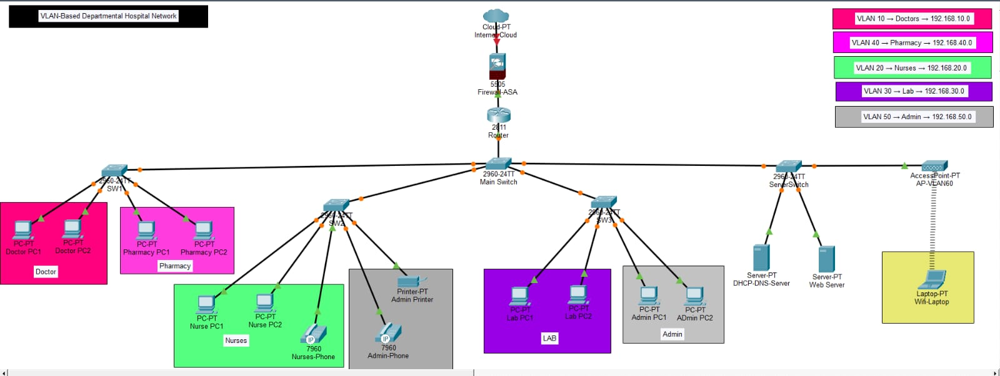
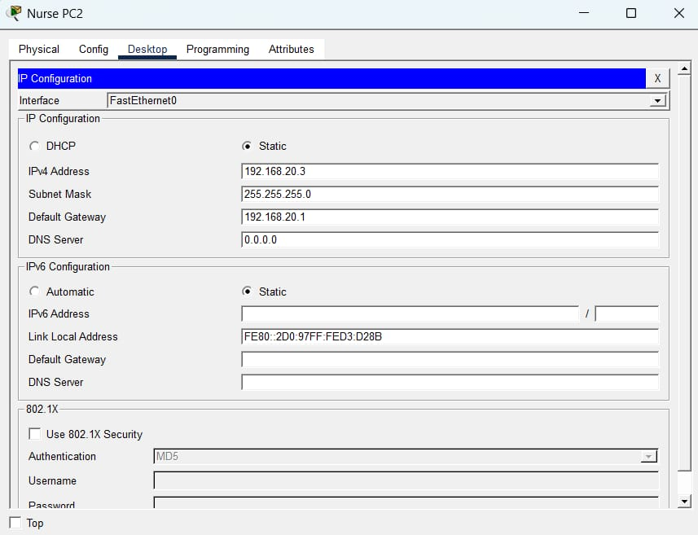
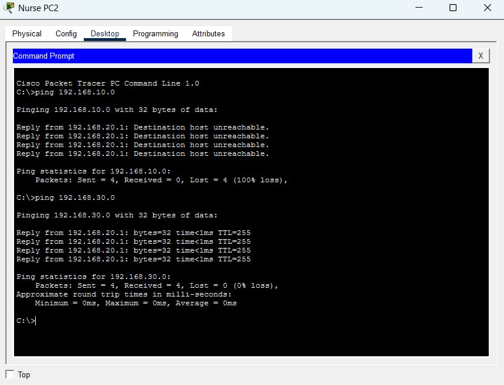

# VLAN-Network-Project
Computer Networks mini project using VLAN in Cisco Packet Tracer

# 🏥 VLAN-Based Hospital Network

## 🔧 Implementation using Cisco Packet Tracer

---

## 📌 Overview

This project presents a structured implementation of **Virtual Local Area Networks (VLANs)** to segment a hospital network into logically isolated domains.

The design focuses on improving:

* Network security through isolation
* Traffic efficiency by reducing broadcast domains
* Scalability and manageability of departmental communication

---

## 🛠️ Technologies Used

* Cisco Packet Tracer
* Layer 2 Switching (VLAN Segmentation)
* IP Addressing & Subnetting
* Network Diagnostics (ICMP / Ping)

---

## 🌐 Network Architecture

The network is divided into multiple VLANs representing functional units within a hospital environment:

* **VLAN 10** → Doctors → `192.168.10.0/24`
* **VLAN 20** → Nurses → `192.168.20.0/24`
* **VLAN 30** → Laboratory → `192.168.30.0/24`
* **VLAN 40** → Pharmacy → `192.168.40.0/24`
* **VLAN 50** → Administration → `192.168.50.0/24`

Each VLAN operates as an independent broadcast domain.

---

## ⚙️ Configuration Summary

### VLAN Segmentation

* VLANs created and named per department
* Logical grouping enforced at switch level

### Port Configuration

* Access ports assigned to respective VLANs
* Ensures strict intra-VLAN communication

### IP Addressing

* Unique subnet assigned per VLAN
* Default gateway configured for each segment

### Connectivity Validation

* ICMP (ping) used to verify:

  * Successful communication within VLAN
  * Isolation across VLANs (no routing configured)

---

## 📸 Screenshots

### 🖥️ Network Topology

---

### 🌐 IP Configuration (Sample Node)

---

### 📡 Connectivity Test

---

## 📂 Project Artifact

* `Project_HospitalManagementSystem.pkt`
  → Complete network topology and configuration

---

## 🧠 Key Observations

* VLAN segmentation effectively isolates traffic between departments
* Broadcast traffic is confined within individual VLANs
* Cross-VLAN communication fails without routing, validating isolation
* Structured IP allocation simplifies network management

---

## 🚀 Future Enhancements

* Inter-VLAN Routing using Layer 3 devices
* Access Control Lists (ACLs) for policy enforcement
* DHCP-based dynamic IP allocation
* Network monitoring and logging mechanisms

---

## 🔗 Repository

https://github.com/phalgunidhopte06/VLAN-Network-Project

## Observation
Added connectivity testing details

## IP Addressing
Added VLAN Configuration details

